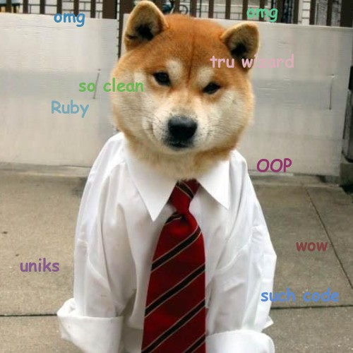

# README

This repository contains a set of extremely half-assed Ruby scripts used to
perform (again) extremely half-assed analysis on the subreddit
[/r/amsterdam](http://reddit.com/r/amsterdam), though you can run it on other
subreddits if you want to.

The code used here is a giant hack that I mostly wrote while making dinner. The
same goes for the algorithm used to, for example, determine the possible gender
of a Reddit self post.

## Requirements

* Ruby 1.9.3 or newer
* PostgreSQL/some other inferior SQL database
* Bundler
* Internet access (shocking!)

## Usage

First install bloat:

    bundle install

Then fetch some pages:

    ruby ./bin/posts.rb

Then try to get the genders of each post (ignoring that the definition of
"gender" is rather complex and subject to debate):

    ruby ./bin/identify.rb

Then see if your subreddit is used by a bunch of creeps:

    ruby ./bin/gender_bias.rb

## License

As usual all the source code in this repository is licensed under the MIT
license unless specified otherwise. A copy of this license can be found in the
file "LICENSE" in the root directory of this repository.
